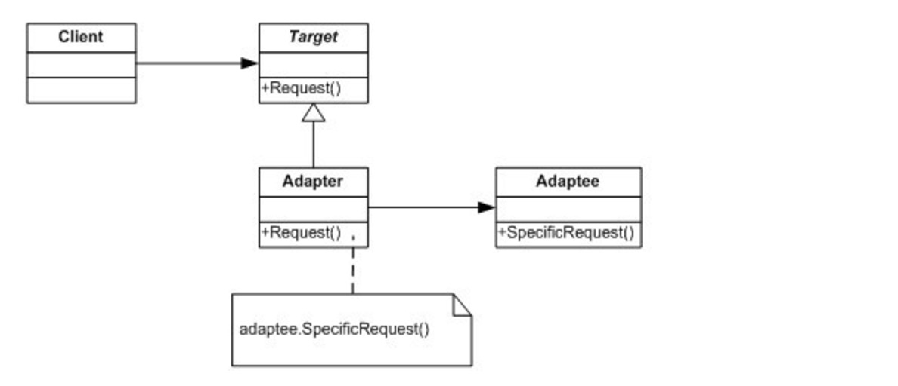

# 适配器模式介绍

### concept
将一个类的接口转换成客户希望的另外一个接口。

适配器模式使得原本由于接口不兼容而不能一起工作的那些类可以一起工作。



接口定义：

```go
package adapter

type Player interface {
	PlayMusic()
}

func play(player Player) {
	player.PlayMusic()
}

func main() {
	var player Player = MusicPlayer{
		Src: "周杰伦很帅",
	}
	play(player)
}
```

接口的一种实现：

```go
package adapter

import "fmt"

type MusicPlayer struct {
	Src string
}

func (p MusicPlayer) PlayMusic() { //实现了Player 的接口
	fmt.Println("play music: " + p.Src)
}

```

需要适配的

```go
package adapter

import "fmt"
//需要适配的 
type GameSoundPlayer struct {
	Src string
}

func (p GameSoundPlayer) PlaySound() {
	fmt.Println("play sound: " + p.Src)
}
```

适配器的实现:

实现接口，然后封装原来的结构体

```go
package adapter

//封装一下
type GameSoundAdapter struct {
	SoundPlayer GameSoundPlayer
}
//实现接口
func (p GameSoundAdapter) PlayMusic() {
	p.SoundPlayer.PlaySound()
}

```
