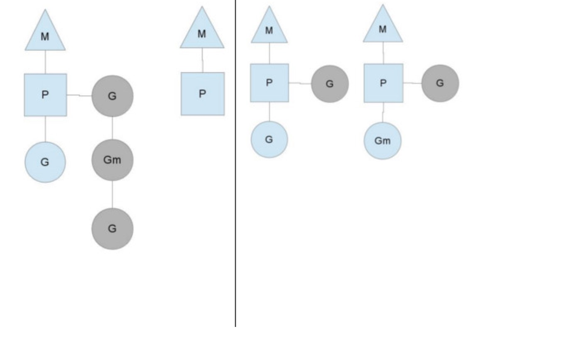

# Goroutine

相对java go 的一个优势就是方便编写并发程序

## 简单用法

```go
//go 关键字放在方法调用前新建一个 goroutine 并执行方法体
go GetThingDone(param1, param2);
 
//新建一个匿名方法并执行
go func(param1, param2) {
}(val1, val2)
 
//直接新建一个 goroutine 并在 goroutine 中执行代码块
go {
    //do someting...
}
```

因为 goroutine 在多核 cpu 环境下是并行的.

如果代码块在多个 goroutine 中执行，我们就实现了代码并行。

## 几种多线程模型

#### 用户线程与内核级线程

线程的实现可以分为两类：

用户级线程(User-LevelThread, ULT)和内核级线程(Kemel-LevelThread, KLT)。

用户线程由用户代码支持，内核线程由操作系统内核支持。

#### 多线程模型

多线程模型即用户级线程和内核级线程的不同连接方式。

- 多对一模型（M : 1）

将多个用户级线程映射到一个内核级线程，线程管理在用户空间完成。 

此模式中，用户级线程对操作系统不可见（即透明）。
<br>


优点： 这种模型的好处是线程上下文切换都发生在用户空间，避免的模态切换（mode switch），从而对于性能有积极的影响。

缺点：所有的线程基于一个内核调度实体即内核线程，这意味着只有一个处理器可以被利用，在多处理器环境下这是不能够被接受的，本质上，用户线程只解决了并发问题，但是没有解决并行问题。如果线程因为 I/O 操作陷入了内核态，内核态线程阻塞等待 I/O 数据，则所有的线程都将会被阻塞，用户空间也可以使用非阻塞而 I/O，但是不能避免性能及复杂度问题。

-  一对一模型（1：1）
<br>


将每个用户级线程映射到一个内核级线程。

优点：在多核处理器的硬件的支持下，内核空间线程模型支持了真正的并行，当一个线程被阻塞后，允许另一个线程继续执行，所以并发能力较强。

缺点：每创建一个用户级线程都需要创建一个内核级线程与其对应，这样创建线程的开销比较大，会影响到应用程序的性能。

- 多对多模型（M : N）

内核线程和用户线程的数量比为 M : N，内核用户空间综合了前两种的优点。 
<br>


这种模型需要内核线程调度器和用户空间线程调度器相互操作，本质上是多个线程被绑定到了多个内核线程上，这使得大部分的线程上下文切换都发生在用户空间，而多个内核线程又可以充分利用处理器资源。

## goroutine 的调度实现

goroutine机制实现了M : N的线程模型。

goroutine机制是协程（coroutine）的一种实现。

golang内置的调度器，可以让多核CPU中每个CPU执行一个协程。

理解goroutine机制的原理，关键是理解Go语言`scheduler`(调度器)的实现。

#### 调度器是如何工作的，

Go语言中支撑整个scheduler实现的主要有4个重要结构，分别是M、G、P、Sched， 前三个定义在runtime.h中，Sched定义在proc.c中。

- `Sched`结构就是调度器，它维护有存储M和G的队列以及调度器的一些状态信息等。

- M结构是`Machine`，系统线程，它由操作系统管理的，goroutine就是跑在M之上的；M是一个很大的结构，里面维护小对象内存cache（mcache）、当前执行的goroutine、随机数发生器等等非常多的信息。

- P结构是Processor，处理器，它的主要用途就是用来执行goroutine的，它维护了一个goroutine队列，即runqueue。Processor是让我们从N:1调度到M:N调度的重要部分。

- G是goroutine实现的核心结构，它包含了栈，指令指针，以及其他对调度goroutine很重要的信息，例如其阻塞的channel

Processor的数量是在启动时被设置为环境变量GOMAXPROCS的值，或者通过运行时调用函数GOMAXPROCS()进行设置。

Processor数量固定意味着任意时刻只有GOMAXPROCS个线程在运行go代码。


我们分别用三角形，矩形和圆形表示Machine Processor和Goroutine。

<br>


在单核处理器的场景下，所有goroutine运行在同一个M系统线程中.

每一个M系统线程维护一个Processor，任何时刻，一个Processor中只有一个goroutine，其他goroutine在runqueue中等待。一个goroutine运行完自己的时间片后，让出上下文，回到runqueue中。 多核处理器的场景下，为了运行goroutines，每个M系统线程会持有一个Processor。

<br>


在正常情况下，scheduler会按照上面的流程进行调度，但是线程会发生阻塞等情况，看一下goroutine对线程阻塞等的处理。

***线程阻塞***

当正在运行的goroutine阻塞的时候，例如进行系统调用，会再创建一个系统线程（M1），当前的M线程放弃了它的Processor，P转到新的线程中去运行。

<br>


***runqueue执行完成***

当其中一个Processor的runqueue为空，没有goroutine可以调度。它会从另外一个上下文偷取一半的goroutine。

<br>



